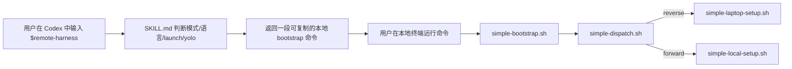
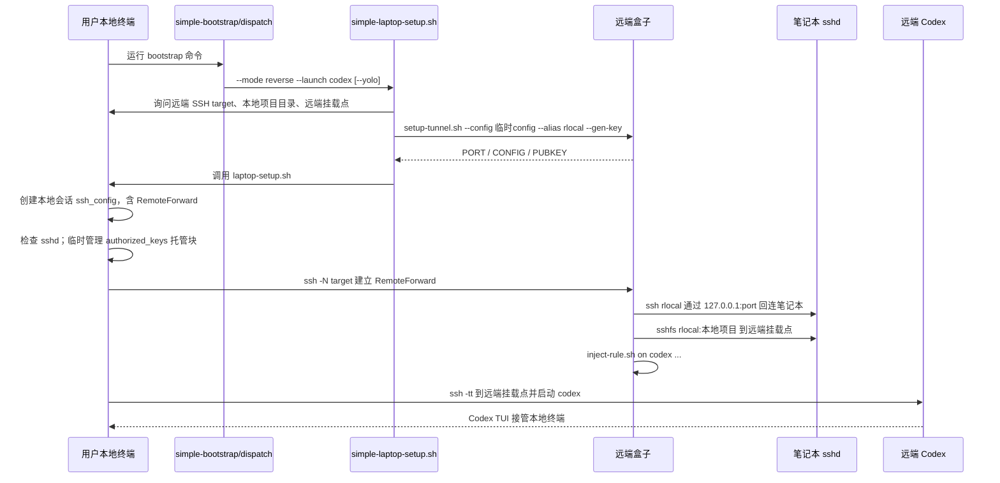
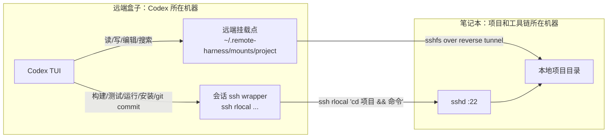
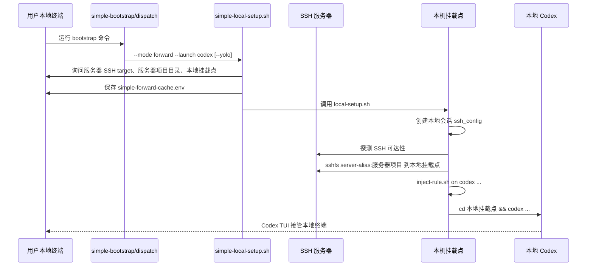
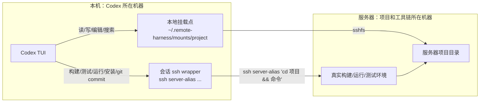

# Remote Harness 完整流程总览

> 英文对应文档见 [complete-flow.md](complete-flow.md)。可视化 HTML 见 [complete-flow.html](complete-flow.html)。

本文从用户在 Codex 中启动 `$remote-harness` 开始，完整梳理 simple reverse 和 simple forward 两种模式，
一直到最终拉起 Codex TUI、退出后自动清理为止。

## 角色与方向

remote-harness 的关键不是“本地/远端”这两个词，而是哪台机器承担哪个角色：

| 角色 | 含义 | Reverse | Forward |
|---|---|---|---|
| 用户本地终端 | 用户最终粘贴并运行 bootstrap 命令的地方 | 笔记本 | 本机 |
| Codex 运行机器 | 最终启动 Codex TUI 的地方 | 远端盒子 | 本机 |
| 项目所在机器 | 代码和真实工具链所在的地方 | 笔记本 | SSH 服务器 |
| 脚本来源机器 | `simple-bootstrap.sh` 所在位置 | 可能是远端 skill/source | 可能是本地或远端 source |

简短触发词：

- `远程开发本地`：走 **simple reverse**，Codex 在远端盒子，项目在本地笔记本。
- `本地开发远程项目`：走 **simple forward**，Codex 在本机，项目和开发环境在服务器。
- 无法判断：输出同一个 bootstrap，不带 `--mode`，由本地 `simple-dispatch.sh` 交互选择，默认 reverse。

## 总入口

用户在某个 Codex 会话中输入：

```text
$remote-harness 中文，yolo
```

skill 做的事情只有三类：

1. 判断模式：reverse、forward 或交给本地选择。
2. 判断运行时：Codex 对应 `--launch codex`。
3. 判断是否显式 YOLO：若用户已说 `yolo`、`免审批`、`无审核` 等，则命令追加 `--yolo`，本地向导不再二次询问。

skill 不在聊天里询问 SSH target、项目路径、挂载点、端口、命名空间，也不要求 Agent 持有这些信息。



## 统一 Bootstrap

公开入口永远是 `scripts/simple-bootstrap.sh`。

如果用户运行命令的机器已经安装 remote-harness，命令形态是：

```bash
RH_LANG=zh bash "${RH_HOME:-$HOME/.remote-harness}/scripts/simple-bootstrap.sh" \
  --mode reverse --launch codex --yolo
```

如果脚本只在远端 skill/source 机器上，命令会先从远端读取 `simple-bootstrap.sh`，再在本地执行。
fetch 阶段使用本地 `~/.remote-harness/.sessions/fetch.*` 里的临时 `known_hosts`，不写本机
`~/.ssh/known_hosts`。

`simple-bootstrap.sh` 的职责：

1. 记录或读取本地 `LAST_VIA`，作为下次脚本来源 SSH target 默认值。
2. 如果自身来自本地文件，直接执行同目录的 `simple-dispatch.sh`。
3. 如果自身来自管道，则从脚本来源机器抓取本地侧 helper bundle：
   `_common.sh`、`simple-dispatch.sh`、`simple-laptop-setup.sh`、`simple-local-setup.sh`、
   `laptop-setup.sh`、`local-setup.sh`、`mount-project.sh`、`inject-rule.sh`。
4. 把这些文件放进本地 `~/.remote-harness/.sessions/bootstrap.*` 临时目录。
5. 调用 `simple-dispatch.sh`，退出时删除 bootstrap 临时目录。

`simple-dispatch.sh` 的职责：

1. 如果收到 `--mode reverse` 或 `--mode forward`，直接进入对应向导。
2. 如果没有 `--mode`，在本地终端提示选择：`1=reverse`、`2=forward`。
3. 把选择缓存到 `~/.remote-harness/simple-mode-cache.env`。
4. reverse 移交给 `simple-laptop-setup.sh`，forward 移交给 `simple-local-setup.sh`。

## Simple Reverse 完整流程

目标：Codex 在远端盒子启动；本地笔记本项目通过反向 SSH 隧道和 sshfs 挂载到远端。



### Reverse 阶段拆解

1. `simple-laptop-setup.sh` 在本地终端收集：
   - 远端 SSH target/args 或 Host alias；
   - 本地项目目录；
   - 远端挂载点，留空则为远端 `~/.remote-harness/mounts/<project>`；
   - 是否 YOLO；若 skill 命令已带 `--yolo`，跳过该问题。
2. 它把确认过的值保存到本地 `~/.remote-harness/simple-cache.env`。
3. 它 SSH 到远端，创建远端会话目录 `~/.remote-harness/.sessions/simple.*/ssh_config`。
4. 远端执行 `setup-tunnel.sh`：
   - 推导或选择反向端口；
   - 优先复用远端 `~/.remote-harness/keys/id_ed25519`；
   - 若不存在且传了 `--gen-key`，生成 remote-harness 专用 key；
   - 写入远端临时 alias `rlocal`，指向 `127.0.0.1:<port>`；
   - 输出 `PORT`、`CONFIG`、`PUBKEY`。
5. 本地执行 `laptop-setup.sh`：
   - 为本地到远端盒子的连接创建本地会话 ssh config；
   - 其中包含 `RemoteForward <port> 127.0.0.1:22`；
   - SSH runtime 文件在本地 `~/.remote-harness/.sessions/rev.*` 中。
6. `laptop-setup.sh` 检查本地 SSH server：
   - 已监听则继续；
   - 未监听时按系统提示开启或安装。
7. `laptop-setup.sh` 管理 reverse 认证：
   - 如果本地 `authorized_keys` 已有匹配有效 key，则复用，不追加；
   - 否则追加带 `remote-harness:reverse-auth:<tag>` 的托管块；
   - 授权行限制为 `from="127.0.0.1,::1"`，并禁用 agent/X11/port forwarding/pty；
   - 引用 token 位于 `~/.remote-harness/.sessions/authorized-keys/...`；
   - 最后一个会话退出时删除托管块。
8. `laptop-setup.sh` 用 `ssh -N` 建立反向隧道：
   - 远端盒子的 `127.0.0.1:<port>` 转发回本机 `127.0.0.1:22`；
   - 若端口被占用且不是当前笔记本，会自动切换邻近端口并更新远端 alias。
9. 远端运行 `check-tunnel.sh --ssh-config <远端临时config>`，确认 `rlocal` 真正连回本笔记本。
10. 远端运行 `mount-project.sh`：
    - 通过 `sshfs rlocal:<本地项目目录> <远端挂载点>` 挂载；
    - `sshfs` 的 `ssh_command` 使用远端会话 config；
    - 远端缺 `sshfs` 或挂载点非空时会交互提示。
11. 远端运行 `inject-rule.sh on codex ...`：
    - 生成会话级规则文件；
    - 生成会话级 `bin/ssh` wrapper，使 Codex 看到短命令 `ssh rlocal ...`；
    - Codex 非 YOLO 时追加 `-s workspace-write`、网络访问和必要 writable roots；
    - Codex YOLO 时使用 Codex 自身 bypass 参数。
12. `laptop-setup.sh` 最后执行：

```bash
ssh -tt <远端target> 'cd <远端挂载点> && exec "${SHELL:-/bin/bash}" -lic "codex ..."'
```

此时本地终端变成远端 Codex TUI。

### Reverse 的命令路由



## Simple Forward 完整流程

目标：Codex 在本机启动；服务器项目通过 sshfs 映射到本地；项目命令通过 SSH 回到服务器执行。



### Forward 阶段拆解

1. `simple-local-setup.sh` 在本地终端收集：
   - 服务器 SSH target/args 或 Host alias；
   - 服务器项目目录；
   - 本地挂载点，留空则为 `~/.remote-harness/mounts/<project>`；
   - 是否 YOLO；若 skill 命令已带 `--yolo`，跳过该问题。
2. 它把确认过的值保存到 `~/.remote-harness/simple-forward-cache.env`。
3. 它调用 `local-setup.sh`。
4. `local-setup.sh` 解析服务器 SSH target：
   - 如果是裸 Host alias，沿用该短名，但通过本地会话 config 的只读 `Include ~/.ssh/config` 解析；
   - 如果是原始 SSH args，则创建会话级 `<host>-dev` alias；
   - `known_hosts` 在本地 `~/.remote-harness/.sessions/fwd.*` 中，且会话 config 关闭 OpenSSH multiplexing。
5. `local-setup.sh` 探测服务器 key auth；如果需要密码，会提示用户体验可能不够顺滑。
6. 本地运行 `mount-project.sh --ssh-config <本地临时config>`：
   - `sshfs <server-alias>:<服务器项目目录> <本地挂载点>`；
   - 本地没有 `sshfs` 时提示安装；
   - 本地挂载点非空时提示更换。
7. 本地运行 `inject-rule.sh on codex ...`：
   - 规则允许 Codex 在本地挂载目录中读写、编辑、搜索；
   - 规则要求构建、运行、测试、安装依赖、lint、formatter、language server、迁移、会修改状态的 git 命令等，都通过 `ssh <server-alias> 'cd <服务器项目目录> && <cmd>'` 在服务器执行；
   - 临时 `ssh` wrapper 隐藏 `-F <临时config>`。
8. `local-setup.sh` 在本地挂载点拉起 Codex：

```bash
cd <本地挂载点> && exec "${SHELL:-/bin/bash}" -lic "codex ..."
```

此时本地终端变成本地 Codex TUI。

### Forward 的命令路由



## Codex 启动参数

remote-harness 对 Codex 使用会话级注入，不修改全局 Codex 配置：

| 场景 | Codex 工作目录 | 文件操作 | 项目命令 | Codex 额外参数 |
|---|---|---|---|---|
| Reverse | 远端挂载点 | 远端挂载点内进行，写回笔记本 | `ssh rlocal 'cd <本地项目> && <cmd>'` | `-c developer_instructions=<rule>` |
| Forward | 本地挂载点 | 本地挂载点内进行，写回服务器 | `ssh <server-alias> 'cd <服务器项目> && <cmd>'` | `-c developer_instructions=<rule>` |
| 非 YOLO | 同上 | 同上 | 同上 | 额外加 `-s workspace-write`、网络访问和必要 writable roots |
| YOLO | 同上 | 同上 | 同上 | `codex --dangerously-bypass-approvals-and-sandbox` |

注入规则和临时 wrapper 都放在 `~/.remote-harness/.sessions/<session-key>`，退出时删除。

## 文件、缓存与清理

| 文件/目录 | 位置 | 用途 | 清理策略 |
|---|---|---|---|
| `simple-cache.env` | 本机 `~/.remote-harness` | reverse 的上次输入默认值 | 用户可删除重置 |
| `simple-forward-cache.env` | 本机 `~/.remote-harness` | forward 的上次输入默认值 | 用户可删除重置 |
| `simple-mode-cache.env` | 本机 `~/.remote-harness` | 模糊模式下的上次方向选择 | 用户可删除重置 |
| bootstrap bundle | 本机 `~/.remote-harness/.sessions/bootstrap.*` | 从远端 source 抓取 helper 脚本 | bootstrap 退出删除 |
| reverse 本地 ssh config | 本机 `~/.remote-harness/.sessions/rev.*` | 本机到远端的 RemoteForward alias 和 known_hosts | 会话退出删除 |
| reverse 远端 ssh config | 远端 `~/.remote-harness/.sessions/simple.*` | `rlocal` alias 和 known_hosts | 会话退出删除 |
| forward 本地 ssh config | 本机 `~/.remote-harness/.sessions/fwd.*` | server alias 和 known_hosts | 会话退出删除 |
| reverse 远端 key | 远端 `~/.remote-harness/keys/id_ed25519` | 远端回连笔记本的专用 identity | 保留复用 |
| reverse authorized_keys block | 本机 `~/.ssh/authorized_keys` | 仅限回环来源的临时授权 | 引用计数为 0 时删除 |
| 默认挂载点 | `~/.remote-harness/mounts/<project>` | sshfs 挂载目录 | 空目录在退出时删除 |

## 退出清理

Codex TUI 退出后，setup 脚本会按方向清理：

Reverse：

1. 在远端卸载 sshfs。
2. 删除远端会话规则和远端临时 ssh config。
3. 如果没有其他会话仍使用该反向隧道，关闭 `ssh -N` tunnel。
4. 删除本地临时 `authorized_keys` 托管块，前提是引用计数为 0。
5. 删除本地会话 ssh config。

Forward：

1. 在本机卸载 sshfs。
2. 删除本机会话规则。
3. 删除本地会话 ssh config。
4. 默认挂载点若为空则删除。

## 一句话总结

- Reverse：**远端 Codex 看见一个远端挂载目录；真正项目和工具链在笔记本，命令走 `ssh rlocal` 回笔记本。**
- Forward：**本地 Codex 看见一个本地挂载目录；真正项目和工具链在服务器，命令走 `ssh <server-alias>` 回服务器。**
- 两种模式都让 Agent 只看到短 alias 和挂载目录；敏感的 SSH target、路径、临时 config 都由本地脚本和会话目录管理。
