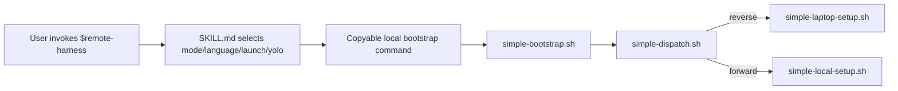
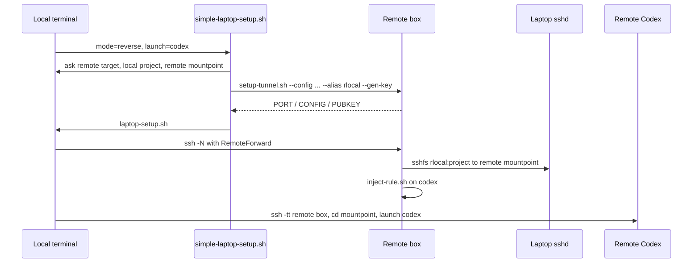
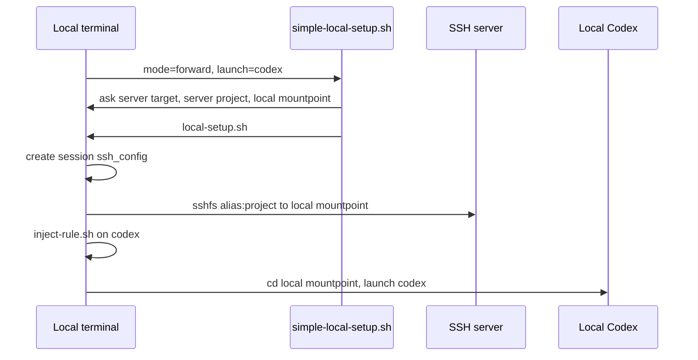

# Remote Harness Complete Flow

> Chinese counterpart: [complete-flow.cn.md](complete-flow.cn.md). Visual HTML: [complete-flow.html](complete-flow.html).

This document summarizes the current simple reverse and simple forward flows from skill invocation
to the final Codex TUI launch.

## Roles

| Role | Reverse | Forward |
|---|---|---|
| User terminal running the bootstrap command | laptop | local machine |
| Codex runtime | remote box | local machine |
| Project and real toolchain | laptop | SSH server |
| Script source | local install or remote skill/source | local install or remote skill/source |

Short trigger phrases:

- Reverse: "remote dev local project" / "远程开发本地".
- Forward: "local dev remote project" / "本地开发远程项目".
- Ambiguous: omit `--mode`; `simple-dispatch.sh` asks locally and defaults to reverse.

## Common Entry

The skill only returns the command. SSH targets, paths, mountpoints, and launch choices are collected
in the user's local terminal. If YOLO was explicit in the invocation, the command includes `--yolo`
and the local wizard does not ask again.

`simple-bootstrap.sh` either delegates to a local install or fetches the helper bundle from a remote
source into local `~/.remote-harness/.sessions/bootstrap.*`, then calls `simple-dispatch.sh`.

## Reverse

Reverse means Codex runs on the remote box while the project and toolchain remain on the laptop.

Key details:

- Remote `rlocal` lives only in remote `~/.remote-harness/.sessions/.../ssh_config`.
- The laptop-to-box RemoteForward alias lives only in local
  `~/.remote-harness/.sessions/reverse-*/ssh_config`.
- The remote box reuses or creates a dedicated key under remote `~/.remote-harness/keys/id_ed25519`.
- The laptop may temporarily add a tagged, loopback-scoped
  `remote-harness:reverse-auth:<tag>` block to `~/.ssh/authorized_keys`; it is reference-counted
  and removed when the last session exits.
- Codex is launched on the remote box inside the remote mountpoint.
- The injected rule tells Codex to run project commands through `ssh rlocal 'cd <project> && <cmd>'`.

## Forward

Forward means Codex runs locally while the project and toolchain live on an SSH server.

Key details:

- `local-setup.sh` always uses a session-local SSH config under
  `~/.remote-harness/.sessions/forward-*`.
- Raw SSH args become a session-local `<host>-dev` alias; an existing Host alias is used through a
  read-only include of the user's SSH config.
- Files are read, written, edited, and searched in the local sshfs mount.
- Project commands run on the server through
  `ssh <server-alias> 'cd <server project> && <cmd>'`.
- Codex is launched locally inside the local mountpoint.

## Codex Injection

`inject-rule.sh` does not modify global Codex config. It writes session artifacts under
`~/.remote-harness/.sessions/<session-key>`.

| Mode | Codex cwd | File work | Project commands |
|---|---|---|---|
| Reverse | remote mountpoint | remote mount, writes back to laptop | `ssh rlocal ...` |
| Forward | local mountpoint | local mount, writes back to server | `ssh <server-alias> ...` |

For Codex, the rule is passed with `-c developer_instructions=<rule>`. Non-YOLO sessions also get
workspace-write, network access, and writable roots for the session SSH runtime directories. YOLO
sessions use Codex's dangerous bypass flag.

## Cleanup

Reverse cleanup unmounts remote sshfs, removes the remote rule and temp SSH config, closes the
reverse tunnel when no other mount needs it, removes the temporary authorized_keys block when its
reference count reaches zero, and removes the local temp SSH config.

Forward cleanup unmounts local sshfs, removes the local rule, removes the session SSH config, and
removes the default empty mountpoint when possible.
